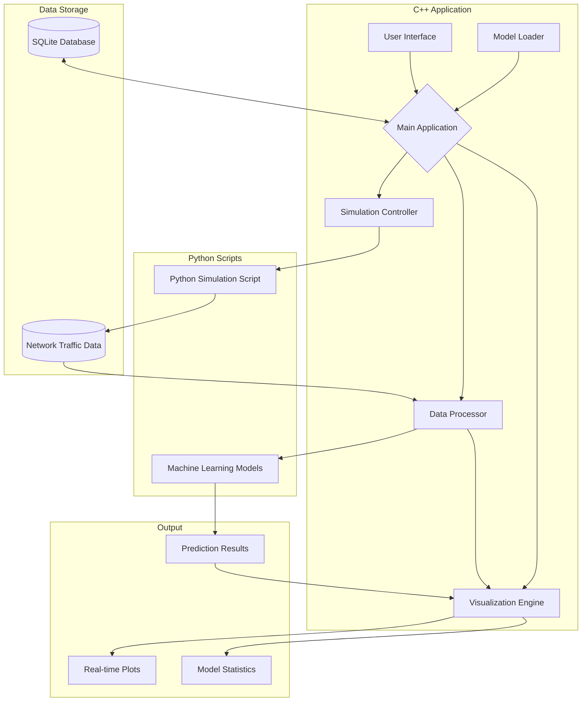

# Smart Grid Anomaly Detection

This project aims to develop a system for identifying cyber attacks on a smart grid network using machine learning techniques. The system simulates normal network traffic data and various attack scenarios, trains machine learning models for anomaly detection, and provides insights into the detected attacks.

## Prerequisites

Before running the project, ensure that you have the following installed:

### 1. Python 3.11 or later
Download and install Python from the official website: https://www.python.org/downloads/
- During installation, make sure to check the option "Add Python to PATH"

### 2. Git
Download and install Git from: https://git-scm.com/downloads
- During installation, choose the option to add Git to your system PATH

### 3. CMake (version 3.10 or later)
Download and install CMake from: https://cmake.org/download/
- During installation, choose the option to add CMake to your system PATH

### 4. C++ compiler (supporting C++17 or later)
For Windows users:
- Install Visual Studio 2019 or later with the "Desktop development with C++" workload
- Download: https://visualstudio.microsoft.com/downloads/

For macOS users:
- Install Xcode from the App Store

For Linux users:
- Install GCC or Clang using your distribution's package manager

After installing these prerequisites, you may need to restart your computer to ensure all PATH updates take effect.

## Project Structure

- `main.cpp`: The main C++ source file containing the code for the real-time network visualization.
- `main.h`: The header file for the main C++ code.
- `model_training_*.py`: Python scripts for training different machine learning models (decision tree, isolation forest, random forest).
- `prediction_script.py`: Python script for making predictions using the trained models.
- `*.pkl`: Trained machine learning model files.
- `setup.bat`: Batch file to set up the project environment and install dependencies.
- `SimComponents.py`: Python module containing simulation components.
- `simulation_script.py`: Python script for generating simulated network traffic data.

## Setup

1. Clone the repository:

git clone https://github.com/vfaillace/SG.git

2. Navigate to the project directory:
cd SG

3. Run the `setup.bat` file to set up the project environment and install dependencies:
setup.bat

This script will:
- Check for required tools (Python, Git, CMake)
- Clone and set up vcpkg (C++ package manager)
- Install required C++ libraries using vcpkg
- Install required Python packages
- Configure and build the C++ project using CMake

4. After the setup is complete, you can find the built executable in the `build/Release` directory.

## Usage

### Generating Simulated Network Traffic Data

To generate simulated network traffic data, run the following command:
python simulation_script.py [include_dos] [port] [total_simulation_time] [dos_attack_time] [start_simulation]

Arguments:
- `include_dos`: Set to "true" to include a DoS attack in the simulation (default: false)
- `port`: Port number for the simulation (default: None)
- `total_simulation_time`: Total simulation time in seconds (default: 20)
- `dos_attack_time`: Time at which the DoS attack starts (default: 10)
- `start_simulation`: Set to "true" to start the simulation immediately (default: false)

Example:

python simulation_script.py true none 30 15 true

python simulation_script.py false 8080

This will generate a file named `network_traffic.csv` with the simulated data.

### Training Machine Learning Models

To train the machine learning models, run the following scripts:

python model_training_decision_tree.py
python model_training_isolation_forest.py
python model_training_random_forest.py

These scripts will read the `network_traffic.csv` file and generate the corresponding `.pkl` model files.

### Running the Visualization

After building the project, you can run the NetworkVisualization executable:

./build/Release/NetworkVisualization.exe

This will start the real-time network traffic visualization and anomaly detection system.

## Troubleshooting

If you encounter any issues during setup or execution:

1. Ensure all prerequisites are correctly installed and configured.
2. Check that the `VCPKG_ROOT` environment variable is set correctly.
3. Verify that Python 3.11 is in your system PATH.
4. Make sure all required Python packages are installed.

## Contributing

Contributions to this project are welcome. Please fork the repository and submit a pull request with your changes.
